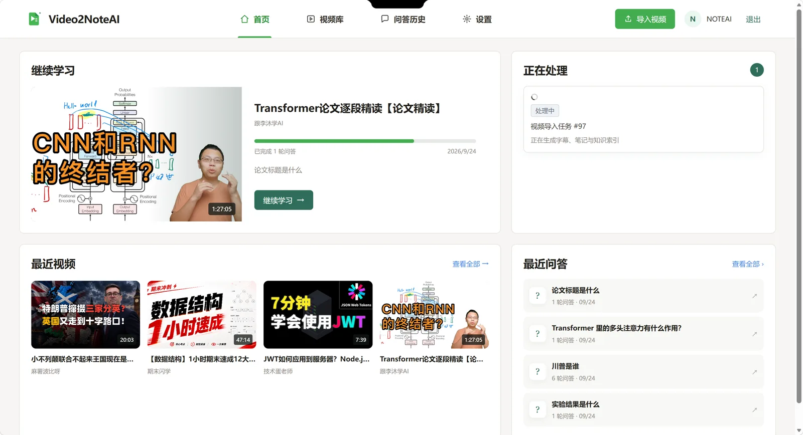
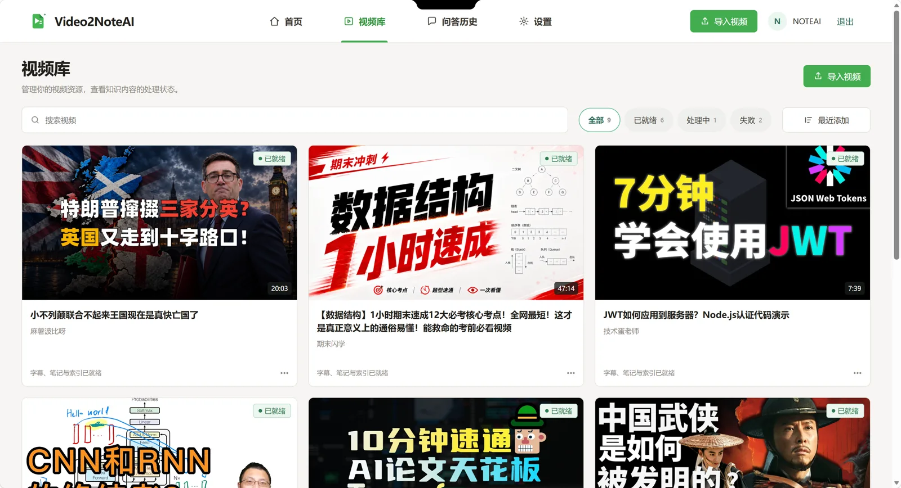
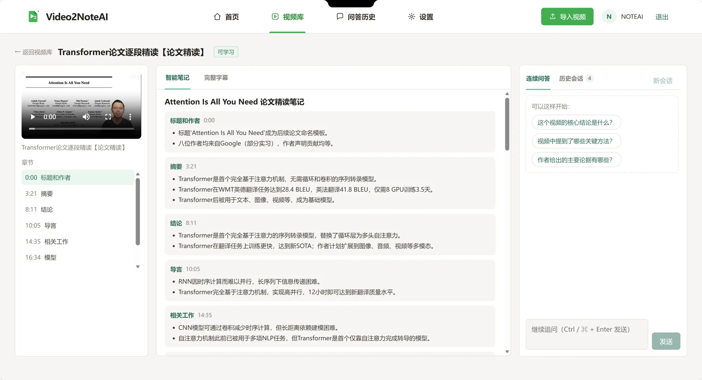
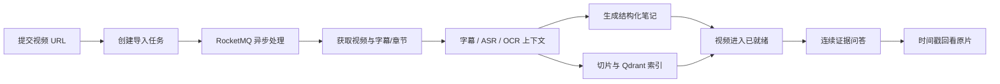

<div align="center">
  
  <h1>Video2NoteAI</h1>

  <p>把在线视频转化为可检索、可追溯、可连续追问的结构化知识。</p>

  <p>
    
    
    
    
    
  </p>
</div>

Video2NoteAI 是一个面向泛知识视频的本地知识工作台。用户提交在线视频 URL 后，系统通过异步任务完成视频获取、字幕/ASR/OCR 解析、章节笔记生成、向量索引和证据问答。回答会绑定原始视频时间戳，用户可以回到对应片段核验内容。

当前接入范围为 B 站普通公开视频的单个可播放单元：普通单 P，或带有效 `?p=n` 的指定分 P。未指定分 P 的多 P 稿件、合集和批量导入暂不自动展开。

## 界面预览

### 首页任务面板



### 视频库



### 单视频知识工作台



## 核心能力

- **URL 异步导入**：HTTP 请求只负责创建任务，解析、下载和知识构建由 RocketMQ 异步执行。
- **字幕优先的多模态理解**：优先使用平台 CC 字幕；不可用时回退 ASR，并结合 OCR、章节和时间轴形成统一上下文。
- **结构化视频笔记**：自动生成摘要、章节要点和带时间戳证据的初始笔记。
- **连续证据问答**：支持单视频多轮追问、问题改写、历史会话恢复和原片时间点跳转。
- **混合知识检索**：Chunk 与 Embedding 写入 Qdrant；检索结果经过证据约束后再交给模型回答。
- **可恢复异步链路**：MySQL 保存业务事实与 Checkpoint，Redis 用于缓存、锁、限流和热点会话。
- **用户隔离**：媒体关系、会话、问答轮次和本地缓存都按用户隔离。

## 处理流程



## 技术栈

| 层次 | 技术 | 用途 |
| --- | --- | --- |
| 前端 | Vue 3、TypeScript、Vite、Pinia、SSE、IndexedDB | 首页、视频库、工作台、任务进度与会话恢复 |
| 后端 | Java 21、Spring Boot 3.5.9、Undertow、MyBatis-Plus、Flyway | 鉴权、媒体管理、任务编排和 REST API |
| 异步与缓存 | RocketMQ 5.3.4、Redis 7.4、Redisson | 消息削峰、幂等、锁、限流与热点状态 |
| 数据与存储 | MySQL 8、MinIO、Qdrant | 业务数据、媒体对象、Checkpoint 与向量索引 |
| 视频与 AI | FFmpeg、Tesseract、yt-dlp、LangChain4j、DeepSeek、BGE-M3、TeleSpeechASR | 视频获取、多模态解析、Agent 推理与向量化 |
| 本地编排 | Docker Compose | 启动 MySQL、Redis、MinIO、Qdrant 与 RocketMQ |

## 安装与启动

以下步骤面向本地开发环境。Windows 推荐使用 PowerShell 7；macOS/Linux 使用 Bash。

### 1. 环境要求

| 组件 | 版本/要求 | 是否必需 |
| --- | --- | --- |
| JDK | 21，建议配置 `JAVA_HOME` | 是 |
| Node.js | 22+，自带 npm | 是 |
| Docker | Docker Desktop 或 Docker Engine，Compose v2 | 是 |
| FFmpeg | 命令行可直接调用 | 是 |
| Tesseract | 命令行可调用，安装 `chi_sim` 与 `eng` 语言包 | 是 |
| yt-dlp | 命令行可直接调用 | 是 |
| Maven | 不需要单独安装，仓库包含 Maven Wrapper | 否 |

安装完成后检查：

```powershell
java -version
node --version
docker compose version
ffmpeg -version
tesseract --version
tesseract --list-langs
yt-dlp --version
```

`tesseract --list-langs` 应至少包含 `chi_sim` 和 `eng`。如果系统找不到 yt-dlp，可安装官方可执行文件并加入 `PATH`，或使用：

```powershell
python -m pip install --upgrade yt-dlp
```

### 2. 准备本地配置

进入仓库根目录，复制环境变量模板：

**Windows PowerShell**

```powershell
Copy-Item .env.example .env
notepad .env
```

**macOS / Linux**

```bash
cp .env.example .env
${EDITOR:-vi} .env
```

至少修改以下配置，不能继续使用 `change-*` 示例值：

```env
DB_PASSWORD=your-database-password
MYSQL_ROOT_PASSWORD=your-root-password
REDIS_PASSWORD=your-redis-password
MINIO_SECRET_KEY=your-minio-password
QDRANT_API_KEY=your-qdrant-key
```

首次创建数据库时，`DB_USERNAME` 必须与 `MYSQL_APP_USER` 一致。数据库已经初始化后，不要随意修改这两个账号。

模型连接分为聊天、Embedding 和 ASR 三组。最小配置可以让三组都使用硅基流动：

```env
SILICONFLOW_API_KEY=your-siliconflow-key
SILICONFLOW_BASE_URL=https://api.siliconflow.cn/v1
LLM_MODEL=deepseek-ai/DeepSeek-V3.2
EMBEDDING_MODEL=BAAI/bge-m3
ASR_MODEL=TeleAI/TeleSpeechASR
```

也可以让聊天模型使用官方 DeepSeek，Embedding 与 ASR 继续使用硅基流动：

```env
DEEPSEEK_API_KEY=your-deepseek-key
CHAT_BASE_URL=https://api.deepseek.com
CHAT_MODEL=deepseek-v4-flash

SILICONFLOW_API_KEY=your-siliconflow-key
EMBEDDING_MODEL=BAAI/bge-m3
ASR_MODEL=TeleAI/TeleSpeechASR
```

密钥只保存在本机 `.env`，不要提交到 Git。

### 3. 启动基础服务

在仓库根目录执行：

```powershell
docker compose --env-file .env up -d --wait
docker compose --env-file .env ps
```

这会启动：

| 服务 | 本地地址/端口 |
| --- | --- |
| MySQL | `127.0.0.1:3307` |
| Redis | `127.0.0.1:16379` |
| MinIO API | `http://127.0.0.1:9000` |
| MinIO Console | `http://127.0.0.1:9001` |
| Qdrant | `http://127.0.0.1:16333` |
| RocketMQ NameServer | `127.0.0.1:9876` |
| RocketMQ Broker | `127.0.0.1:10911` |

macOS/Linux 也可以使用仓库脚本；它会检查依赖、配置和服务健康状态：

```bash
chmod +x scripts/dev-up.sh
./scripts/dev-up.sh
```

### 4. 启动后端

打开第二个终端，在仓库根目录执行：

**Windows PowerShell**

```powershell
pwsh -File .\scripts\start-server.ps1
```

脚本会读取根目录 `.env`、使用 `JAVA_HOME` 或当前 `java` 命令定位 JDK，并通过项目自带的 Maven Wrapper 启动服务。需要显式指定 JDK 时：

```powershell
pwsh -File .\scripts\start-server.ps1 -JdkHome "C:\Program Files\Java\jdk-21"
```

**macOS / Linux**

```bash
set -a
source .env
set +a
cd server
./mvnw -s .mvn/central-settings.xml spring-boot:run
```

后端默认监听 `http://127.0.0.1:9090`。健康检查：

```powershell
Invoke-RestMethod http://127.0.0.1:9090/health
```

或：

```bash
curl http://127.0.0.1:9090/health
```

成功响应：

```json
{"code":0,"message":"success","data":"UP"}
```

首次启动会由 Flyway 自动创建或升级数据库结构。

### 5. 启动前端

打开第三个终端：

```powershell
cd client
npm ci
npm run dev
```

浏览器访问 `http://localhost:5173`。Vite 会读取根目录 `.env`，并把 API 请求代理到 `VITE_DEV_PROXY_TARGET`，默认是 `http://localhost:9090`。

首次使用请在登录页注册账号。注册成功后返回登录页，再登录进入首页。

### 6. 可选：启用 B 站登录 Cookie

普通公开视频可以匿名导入。需要登录态字幕或更高清晰度时，可以在设置页保存 Cookie；该功能要求 `.env` 中存在 32 字节 Base64 AES 密钥：

**Windows PowerShell**

```powershell
[Convert]::ToBase64String([Security.Cryptography.RandomNumberGenerator]::GetBytes(32))
```

**macOS / Linux**

```bash
openssl rand -base64 32
```

把输出写入：

```env
BILIBILI_COOKIE_KEY=generated-base64-key
```

修改 `.env` 后需要重启后端。Cookie 只保存在服务端加密存储中，禁止把 Cookie 文件或原文提交到仓库。

## 停止服务

前端与后端在各自终端按 `Ctrl+C` 停止。基础服务执行：

```powershell
docker compose --env-file .env down
```

该命令不会删除 MySQL、Redis、MinIO、Qdrant 和 RocketMQ 数据。只有确认需要完全重置本地环境时才执行：

```powershell
docker compose --env-file .env down --volumes
```

`--volumes` 仍不会自动删除仓库中的 `mysql/data`、`redis/data`、`minio/data` 和 `qdrant/data` 绑定目录；删除这些目录前请先备份。

## 验证与测试

### 前端

```powershell
cd client
npm run type-check
npm test -- --run
npm run build
```

### 后端

**Windows**

```powershell
cd server
.\mvnw.cmd -s .mvn\central-settings.xml test
```

**macOS / Linux**

```bash
cd server
./mvnw -s .mvn/central-settings.xml test
```

### 主流程冒烟测试

在前后端和基础服务均运行时：

```powershell
pwsh -File .\scripts\frontend-mainflow-smoke.ps1 -BaseUrl http://localhost:5173 -MediaId 62
```

`MediaId` 需要替换为当前账号视频库中已就绪的视频 ID。

## 常见问题

| 现象 | 排查方式 |
| --- | --- |
| `docker compose` 启动失败 | 确认 Docker Desktop 已运行；检查 `.env` 中所有 `change-*` 密码是否已替换 |
| 后端无法连接 MySQL/Redis | 执行 `docker compose --env-file .env ps`，确认容器健康；核对 `.env` 账号与密码 |
| PowerShell 提示找不到 JDK | 设置 `JAVA_HOME`，或给 `start-server.ps1` 传入 `-JdkHome` |
| 视频导入提示命令不存在 | 确认 `yt-dlp`、`ffmpeg`、`tesseract` 都在 `PATH`；必要时配置 `YTDLP_PATH`、`FFMPEG_DIR`、`OCR_COMMAND` |
| OCR 缺少中文 | 执行 `tesseract --list-langs`，安装 `chi_sim` 语言包 |
| AI 接口返回 401/模型不可用 | 分别检查聊天、Embedding、ASR 的地址、模型与密钥；修改后重启后端 |
| 页面无法访问后端 | 先检查 `http://127.0.0.1:9090/health`，再核对 `VITE_DEV_PROXY_TARGET` |
| B 站字幕/高清流不可用 | 在设置页更新 Cookie，并确认 `BILIBILI_COOKIE_KEY` 已配置后重启后端 |
| Maven 下载失败或被镜像拦截 | 使用 README 中带 `-s .mvn/central-settings.xml` 的命令，绕过失效的用户级镜像 |

## 项目结构

```text
Video2NoteAI/
├── assets/readme/           # README 界面截图
├── client/                  # Vue 3 前端
├── server/                  # Spring Boot API、异步处理与 Video Agent
├── scripts/                 # 启动、冒烟测试、运维与 RAG 评测脚本
├── rocketmq/                # RocketMQ Broker 配置
├── docker-compose.yml       # 本地基础服务编排
└── .env.example             # 环境变量模板
```
